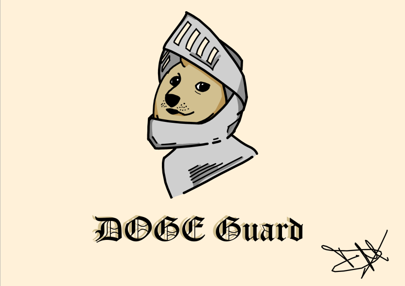
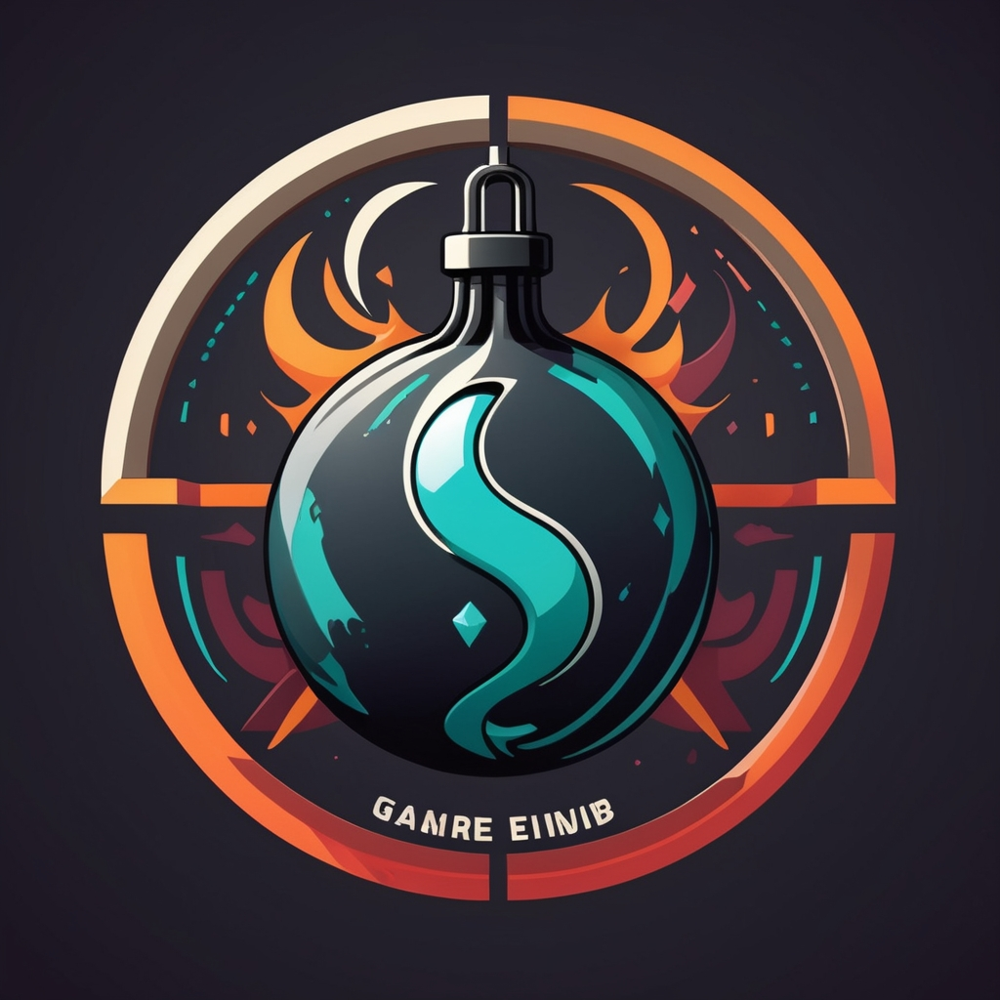

If you want to you can look at this mediocre profile

 

# Welcome Folks!
Name's Diego, but you can call me Como
  
I'm from Italy, something that most people find cool, but I don't.  
I tend to be pessimistic about anything that concerns myself only, you could call me an embedded systems engineer wannabe  

My life: nothing special  
My dream: nothing relevant  
My ambitions: not much  
My philosophy: men are not born engineers, nor they want to become one, but in the end they will either find themselves failures or accept the Eng. title  

  Currently learning Russian

👯 I’m looking to find any meaning in what I'm doing

📝 Rarely active on [Mastodon](https://hachyderm.io/@Comodino)

👀 Ask me about Segfaults, Stack Smashing and why I moved to Rust

📫 You can reach me at comodinocode@proton.me

⚡ Fun fact  - I like Philosophy

# Projects ⚙️
<table bordercolor="#75c1d0">
  
  <tr>
    <td width="50%" valign="top">
      <h3 align="center">DogeGuard (WIP)</h3>
         
        
         
        

             
        
            

                
<strong>Rust</strong> - Passwd Manager : A secure, private, hence self hosted application for managing you passwords and logins!

    </td>
    <td width="50%" valign="top">
      <h3 align="center">cli-party</h3>
         
        
         
        

             
        
            

                
<strong>Python</strong> - Game : My CLI python clone of the famous Bomb Party (no multiplayer for now) 

    </td>
  </tr>
  
</table>

# Technologies & Tools 🔧

 

# GitHub Stats 📈

  

  

  

## Extras 📝

  
Click to expand!

   
    
     
       

