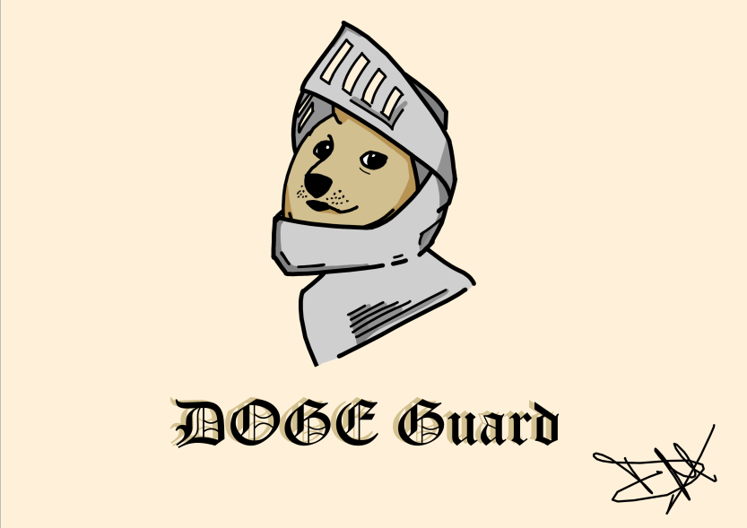
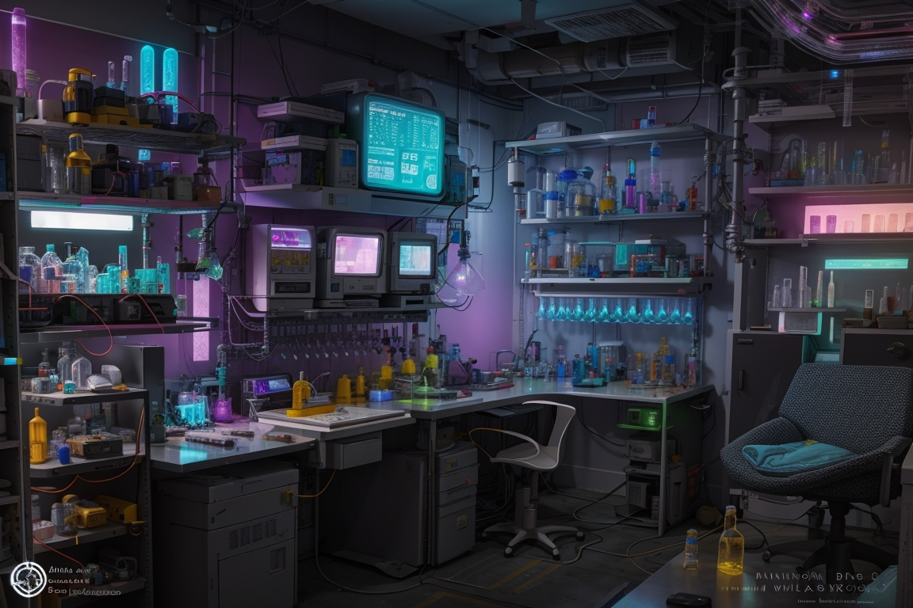

# Welcome Folks! 
 

Name's Diego, but you can call me Como
  
  I'm from Italy, something that most people find cool, but I don't.  
  I tend to be pessimistic about anything that concerns myself only, you could call me an embedded systems engineer wannabe  

  My life: nothing special  
  My dream: nothing relevant  
  My ambitions: not much  
  My philosophy: men are not born engineers, nor they want to become one, but in the end they will either find themselves failures or accept the Eng. title  
  

🌱 I’m currently learning Typescript

👯 I’m looking to find any meaning in what I'm doing

📝 I will hardly ever post on LinkedIn

👀 Ask me about Segfaults, Stack Smashing and why I moved to Rust

📫 You can reach me at comodinocode@proton.me

⚡ Fun fact  - I like Philosophy

 

# Projects ⚙️
<!-- <h1 align="center">Projects</h1> -->
<table bordercolor="#66b2b2">
  
  <tr>
    <td width="50%" valign="top">
      <h3 align="center">DogeGuard (WIP)</h3>
         
        
         
        

             
        
            

                
<strong>Rust</strong> - Passwd Manager : A secure, private, hence self hosted application for managing you passwords and logins!

    </td>
    <td width="50%" valign="top">
      <h3 align="center">comodino-lab (WIP)</h3>
         
        
         
        

             
        
            

                
<strong>Rust, C, C++, PHP</strong> - Learning Projects : Lots of projects that I make while learning new concepts or leanguages 

    </td>
  </tr>
  
</table>

# Technologies & Tools 🔧

 

# GitHub Stats 📈

  

  

  

## Extras 📝
  

  
Click to expand!

   
    

 

  
  

  
  

   
    

<!-- links to social media icons -->

<!-- icons without padding -->

[1.2]: https://raw.githubusercontent.com/MartinHeinz/MartinHeinz/master/linkedin-3-16.png (LinkedIn icon without padding)
[2.2]: http://i.imgur.com/9I6NRUm.png (github icon without padding)

<!-- links to your social media accounts -->

[1]: https://www.linkedin.com/in/diego-gila-428137259/
[2]: https://github.com/llComodino

<!-- default README.md -->
<!--
- 👋 Hi, I’m Rahul Karda
- 👀 I’m interested in Full Stack Web Development and other skills
- 🌱 I’m currently learning React
- 💞️ I’m looking to collaborate on different web dev projects
- 📫 How to reach me - You can contact me on rahulkarda2002@gmail.com
-->
  
------
Credit: [rahulkarda](https://github.com/rahulkarda)
Last Edited on: 08/06/2022
